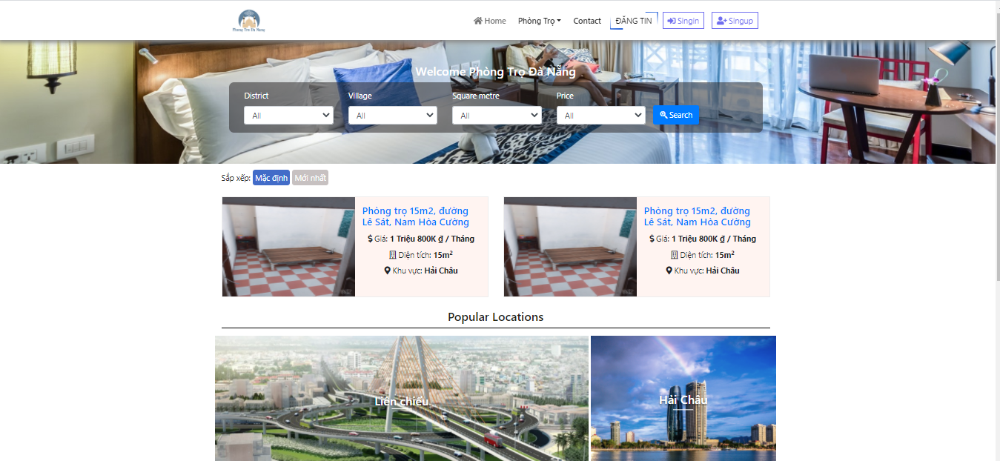
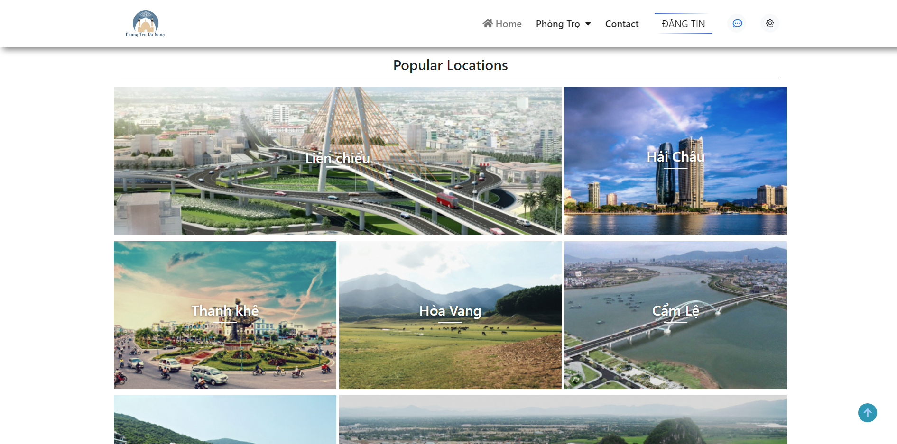
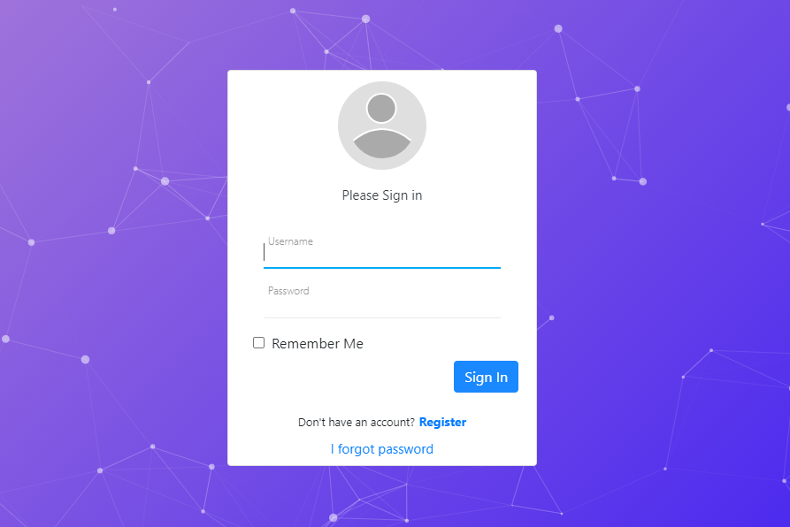
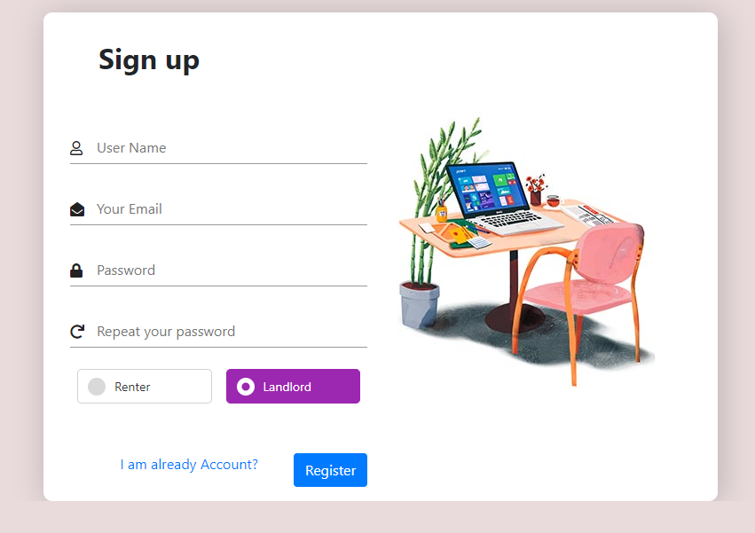
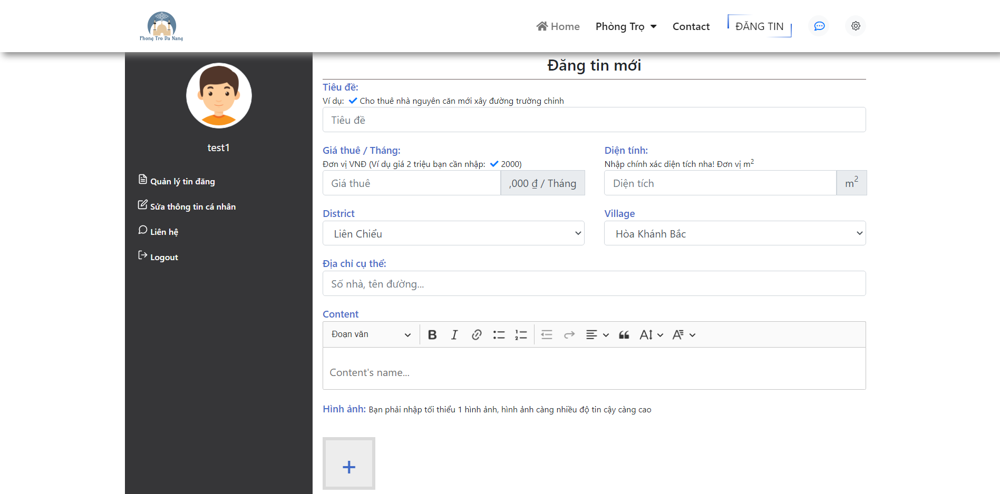
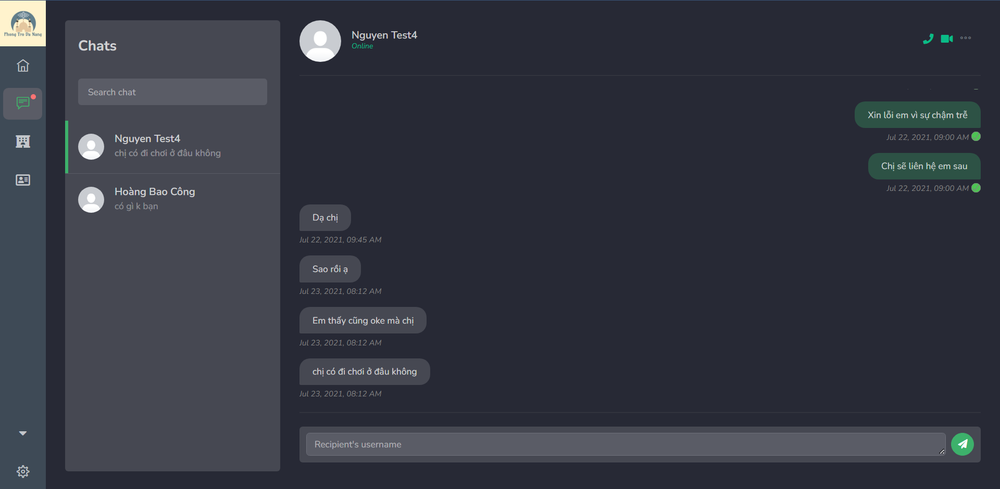
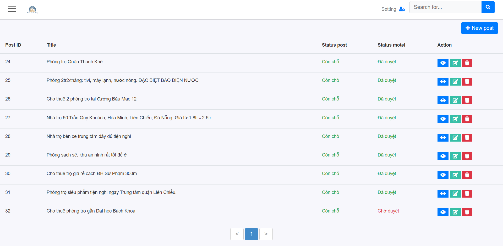
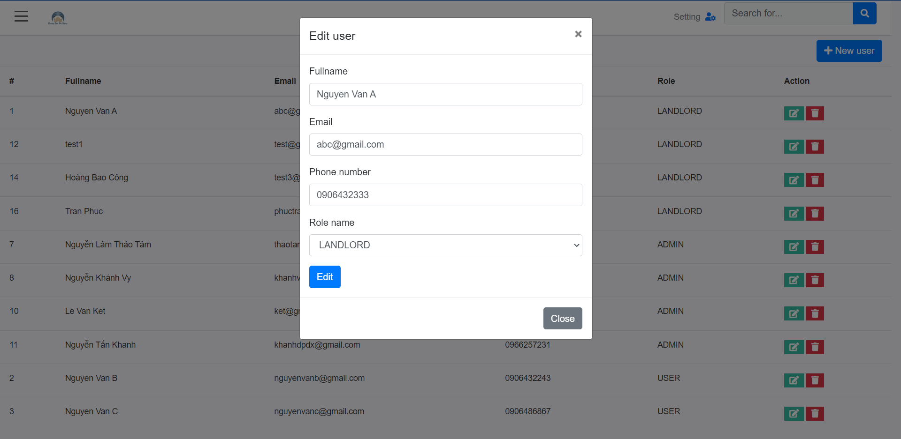

# Website quản lí phòng trọ Đà Nẵng

## Giới thiệu

Website quản lí phòng trọ Đà Nẵng được tạo ra nhằm giải quyết vấn đề
tìm kiếm phòng trọ của sinh viên và người lao động. Đây cũng là nơi 
các chủ trọ có thể đăng những bài đăng cho thuê phòng trọ.
Người xem bài đăng cũng có thể để lại những bình luận hoặc nhắn tin 
với người đăng bài hiện tại.

## Chức năng chính

* Tìm kiếm phòng trọ
* Đăng bài cho thuê phòng trọ
* Trò chuyện 
* Bình luận bài đăng
* Quản lý bài đăng
* Phân quyền

## Công nghệ sử dụng

**Ngôn ngữ lập trình**: Java

**Công nghệ:**
* Jsp/Servlet
* HTML, CSS, Javascript

## Images
**Trang chủ**

**Đăng nhập**

**Đăng ký**

**Đăng bài**

**Trò chuyện**

**Quản lý bài đăng**

**Phân quyền**

